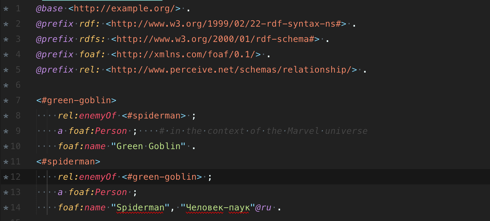

# Turtle Syntax Highlighting

Basic syntax highlighting for Turtle files in Sublime Text 3.

## Installation

The recommended way to install the Sublime Text Turtle syntax is via [Package Control](https://packagecontrol.io/packages/TurtleSyntax). Package Control will install the plugin on your system and keep it up to date.

0. [Ensure Package Control is installed.](https://packagecontrol.io/installation)
0. In Sublime Text, open the `Preferences` menu, and select `Package Control`.
0. Select `Package Control: Install Package`.
0. Start typing `Turtle`. When you see it, select it.
0. Wait for it to install.
0. Re-open any open `.ttl` files, or set their syntax to Turtle manually.
0. Enjoy!

## Color Scheme - Scopes

This package follows the conventions set out in the [official ST3 scope naming documentation](http://www.sublimetext.com/docs/3/scope_naming.html).
